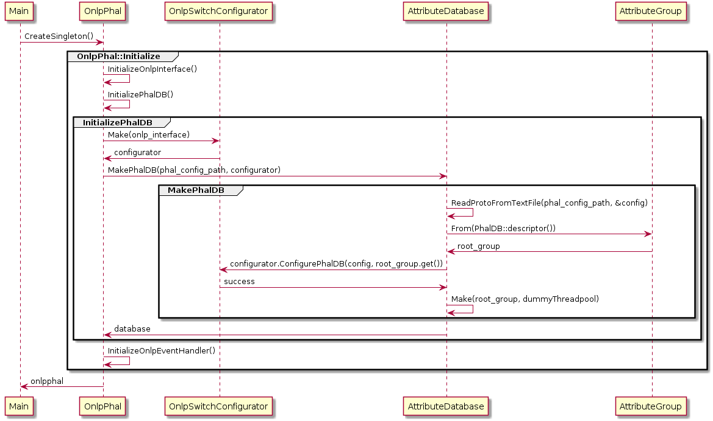
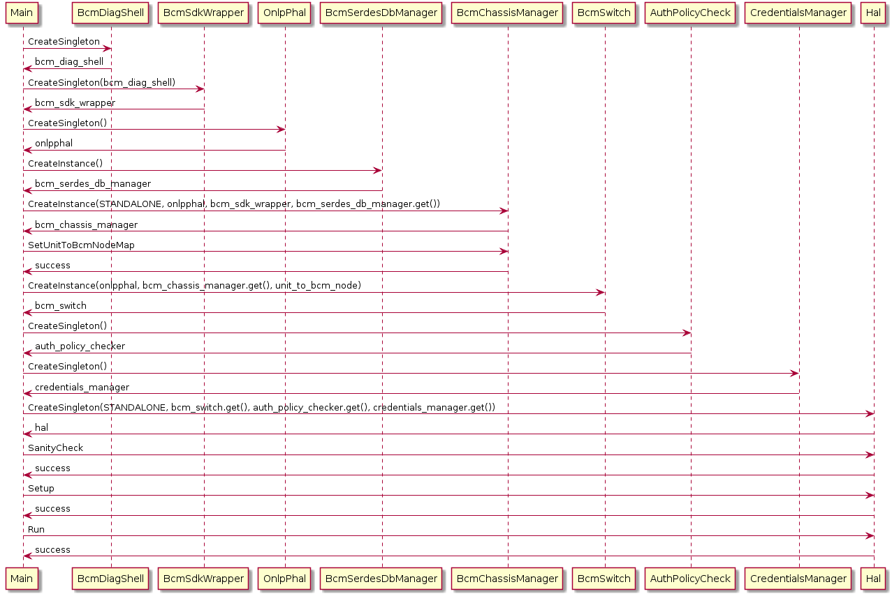
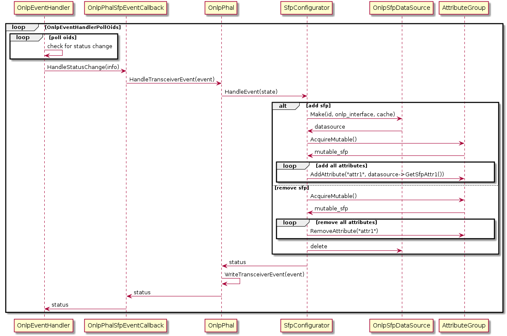
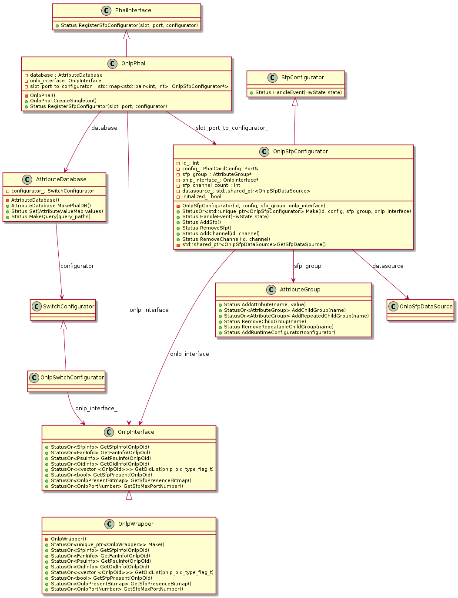

# Stratum Configurators Design Document

## Table of contents
1. [Overview](#overview)
2. [Switch Configurator](#switch_configurator)
3. [Sfp Configurator](#sfp_configurator)
4. [PHal Init Configuration](#phal_init_config)
5. [Protbuf files](#protobuf_files)
6. [Configurator Tests](#configurator_tests)


## Overview <a name="overview"></a>

The attribute database provides the data model abstraction between physical hardare and the upper OpenConfig models in Stratum and is detailed in the [PHAL development tutorial.](phal_development_tutorial.md).

An attribute database "configurator" is a class that populates the attribute database with data source attributes.  This document will detail the design of two different types of configurators:
1. The Switch Configurator: called at startup to initially populate the database.
2. The SFP Configurator: is an example of a "Runtime Configurator" and is called when an SFP is inserted or removed.

**Note:** Over time other 'Runtime Configurators' maybe written to manage other dynamic hardware resources (i.e. multiple cards in the switch chassis).

## Switch Configurator <a name="switch_configurator"></a>
The Switch Configurator is responsible for the initial population of the attribute database, wiring the platform data source attributes into the attribute database tree hierarcy.

The Switch Configurator will parse a protobuf text configuration file given to the stratum agent at runtime (via the --phal_config_path flag) and use this model to create and populate the relevant datasources into the right paths in the attribute database tree.

The following diagram details the high level startup sequence where the switch configurator is called to build the attribute database.


<left>**_Figure 1: Attribute DB bootstrap sequence diagram_** </left>


The ConfigurePhalDB function will then loop through the phal DB hierarchy as populated by the ReadProtoFromTextFile function (see MakePhalDB function below) and add the configured attributes to the attribute DB as per this sequence diagram.


<left>**_Figure 2: ConfigureSwitch sequence diagram_** </left>


### OnlpSwitchConfigurator class <a name="switch_configurator_class"></a>

The OnlpSwitchConfigurator class is derived from the SwitchConfigurator base class and will be instantiated in the InitializePhalDB function as part of the OnlpPhal CreateInstance function as follows:

```
// Initialize the Phal DB
::util::Status OnlpPhal::InitializePhalDB() {

  if (FLAGS_phal_config_path.empty())
      return MAKE_ERROR() << "Must provide a phal_config_path argument.";

  // Create onlp switch configurator instance
  ASSIGN_OR_RETURN(auto configurator,
      OnlpSwitchConfigurator::Make(onlp_interface_.get()));

  // Create attribute database and load initial phal DB
  ASSIGN_OR_RETURN(std::move(database_),
      AttributeDatabase::MakePhalDB(FLAGS_phal_config_path,
          std::move(configurator)));

  return ::util::OkStatus();
}
```

The following class diagram details the relationships between the different classes relevant to the Switch Configurator.


<left>**_Figure 3: Switch Configurator Class diagram_**</left>


### Switch bootstrap <a name="switch_bootstrap"></a>

The following sequence diagram shows the BCM switch's normal bootstrap sequeuence of events and where the Phal Attribute DB is created and configured.


<left>**_Figure 3: Class diagram_**</left>

The SwitchConfigurator classes ConfigurePhalDB function is called from MakePhalDB function which is shown in the sequence diagram above.  Although this sequence diagram depicts the bootstrap sequence of the BCM switch, other switches bootstraps sequences will be similar.


## SFP Configurator <a name="sfp_configurator"></a>

The SFP Configurator event handler is called when an SFP event is received and indicates that the state of the Sfp has changed (i.e. Present or Not-Present).  The SFP Configurator will either add or remove the SFP's attributes from the attribute database as shown in the sequence diagram below based on this event notifcation message.


<left>**_Figure 4: SFP Configurator Event Notification sequence diagram_** </left>


### SfpConfigurator class <a name="sfp_configurator_class"></a>

The SfpConfigurator class is an implementation of the RuntimeConfiguratorInterface and will add or remove SFP attributes from the attribute DB based on the event received (see example code below).

```
::util::Status OnlpSfpConfigurator::HandleEvent(HwState state) {

    // Check SFP state
    switch (state) {
      // Add SFP attributes
      case HW_STATE_PRESENT:
        RETURN_IF_ERROR(AddSfp());
        break;

      // Remove SFP attributes
      case HW_STATE_NOT_PRESENT:
        RETURN_IF_ERROR(RemoveSfp());
        break;

      default:
        return MAKE_ERROR() << "Unknown SFP event state " << state << ".";
    }

    return ::util::OkStatus();
}
```

The following class diagram details the relationships between the different classes relevant to the Sfp Configurator.


<left>**_Figure 4: Sfp Configurator Class diagram_**</left>

## Phal Init Configuration <a name="phal_init_config"></a>

The phal.proto protobuf file provides the basis for the Phal Initial Configuration file that cam be passed in at runtime using the --phal_config_path flag. The basic structure for the configuration is as follows:

* cards: the ports of the switch are contained in the card element and there can be one or more cards in a switch.
* fan_trays: each fan is a member of one fan_tray and there can be one or more fan_trays in a switch.
* psu_trays: each psu is a member of one psu_tray and there can be one or more psu_trays in a switch.
* led_groups: each led is a member of one led_group and there can be one or more led_groups in a switch
* thermal_groups: each thermal is a member of one thermal_group and there can be one or more thermal_groups in a switch.

An example phal_init_config file is contained in the //stratum/hal/config/example_phal_init_config.pb.txt file and looks something like the following:

```
cards {
  ports {
    physical_port_type: PHYSICAL_PORT_TYPE_SFP_CAGE
  }
  ports {
  ...
  ..
  .
}
fan_trays {
  fans {
    id: 1
    cache_policy {
      type: FETCH_ONCE
    }
  }
  fans {
  ...
  ..
  .
}
psu_trays {
  psus {
    id: 1
    cache_policy {
      type: TIMED_CACHE
      timed_value: 10
    }
  }
  psus {
    ...
    ..
    .
}
led_groups {
  leds {
    id: 1
    cache_policy {
    }
  }
}
thermal_groups {
  thermals {
    cache_policy {
      type: TIMED_CACHE
      timed_value: 2
    }
  }
}
```

You'll note the structure allows for different caching types per device, per group of devices (i.e. fan_tray, psu_tray, led_group, thermal_group, card) or a switch wide default can also be specified at the base level and if no cache policies are defined at all then they will default to "NO CACHE".

### Dynamic Phal Init Config Generation

If the phal_config_path flag is not specified at stratum runtime time then it will attempt to build the initial phal config by getting a list of all the ONLP device OIDs from the ONLP API and building the config with a default caching mechanism of "NO CACHE".

### Device IDs

Each device's ID in the phal init configuration can either be specifically set or will be generated dyanmically based on the following rules:

* **ID specified in config:** if specified in the configuration then the Datasource component (i.e. Sfp, Fan, PSU, Led, Thermal) will add the Datasource type to the id in order to create an ONLP OID to use with the ONLP API.  In most instances the device IDs are sequential starting from 1 (i.e. 1-based) and so this makes the configuration easy to read and understand a devices relative position in the switch (i.e. better than trying to translate between ONLP OIDs in the configuration file).
* **ID not specified in config:** if the ID is not specified in the confguration file then an automatic 1-based index ID will be generated based on it's relative position in the configuration file (i.e. cards[0]/ports[0] would have an ID of 1, **Note:** ONLP OIDs can't be zero)
* **Auto generated configuration:** the ID will be generated based on the OID List sent from the ONLP NOS (i.e. the OID type will be masked out leaving just the device id using the ONLP_OID_OF_GET() macro).

## Protobuf files <a name="protobuf_files"></a>

There are three main protobuf files associated with the configuration of the Phal DB:

**//stratum/hal/lib/phal/phal.proto:** is used to store and load the Phal initial configuration into memory and is then parsed by the OnlpSwitchConfigurator::ConfigurePhalDB function to build the Phal Attribute Database.

**//stratum/hal/lib/phal/db.proto:** provides the Phal Attribute Database schema used to enforce the structure of the database and used as the returning protobuf message on "Get" and "Subscription" requests to the database.

**//stratum/hal/lib/common/common.proto:** has many common enum definitions used by both of the above protobuf files in order to translate between the underlying NOS (i.e. ONLP) and it's database protobuf representation.

## Configurator Testing <a name="configurator_tests"></a>

There are several standalone test targets that can be built and run to test different parts of the Configurators and Attribute Database.

### Attribute Database Testing <a name="attribute_database_test"></a>

The //stratum/hal/lib/phal/attribute_database_test bazel target is used to run some standalone tests agains the basic AttributeDatabase.

To run the tests use the following command from inside the stratum dev environment

```
stratum$ bazel test //stratum/hal/lib/phal/attribute_database_test
INFO: Analysed target //stratum/hal/lib/phal:attribute_database_test (0 packages loaded).
INFO: Found 1 test target...
Target //stratum/hal/lib/phal:attribute_database_test up-to-date:
  bazel-bin/stratum/hal/lib/phal/attribute_database_test
INFO: Elapsed time: 0.270s, Critical Path: 0.01s
INFO: 0 processes.
INFO: Build completed successfully, 1 total action
//stratum/hal/lib/phal:attribute_database_test                  (cached) PASSED in 0.1s

INFO: Build completed successfully, 1 total action
```

Once the target has been built (i.e. upon running the test the first time as above or using the bazel "build" command) you will be able to run the test directly by using the direct path as follows:

```
stratum$ ./bazel-bin/stratum/hal/lib/phal/attribute_database_test
Running main() from gmock_main.cc
[==========] Running 7 tests from 1 test suite.
[----------] Global test environment set-up.
[----------] 7 tests from AttributeDatabaseTest
[ RUN      ] AttributeDatabaseTest.CanCreateAndDelete
[       OK ] AttributeDatabaseTest.CanCreateAndDelete (2 ms)
..
..
[ RUN      ] AttributeDatabaseTest.QueryFlushClearsUpdatedQueries
[       OK ] AttributeDatabaseTest.QueryFlushClearsUpdatedQueries (1 ms)
[----------] 7 tests from AttributeDatabaseTest (5 ms total)

[----------] Global test environment tear-down
[==========] 7 tests from 1 test suite ran. (5 ms total)
[  PASSED  ] 7 tests.
```

as seen above this outputs more details around the tests completed and can also be used for debugging purposes if all the tests are not passing.

*Note:* There are some google tests at the end of the attribute_database_test.cc file that are currently commented out.  These will need to be converted to use the MakePhalDB and potentially use a real NOS implementation like ONLP with mock classes in order to the run the tests.

### OnlpSwitchConfigurator tests <a name="switch_configurator_test"></a>

The OnlpSwitchConfigurator class uses the //stratum/hal/lib/phal/onlp:switch_configurator_test target to run some sanity tests on the ConfigurePhalDB function and also writing and reading PhalInitConfg protobuf messages used for configuring the Phal Atrribute DB.

To run these tests you can use the following command from the stratum dev environment:
```
stratum$ bazel test //stratum/hal/lib/phal/onlp:switch_configurator_test
INFO: Analysed target //stratum/hal/lib/phal/onlp:switch_configurator_test (0 packages loaded).
INFO: Found 1 test target...
FAIL: //stratum/hal/lib/phal/onlp:switch_configurator_test (see /home/vagrant/.cache/bazel/_bazel_vagrant/1b07b1db06ec9ee22c71eac6f0bd4549/execroot/com_github_stratum_stratum/bazel-out/k8-fastbuild/testlogs/stratum/hal/lib/phal/onlp/switch_configurator_test/test.log)
Target //stratum/hal/lib/phal/onlp:switch_configurator_test up-to-date:
  bazel-bin/stratum/hal/lib/phal/onlp/switch_configurator_test
INFO: Elapsed time: 5.905s, Critical Path: 5.67s
INFO: 3 processes, processwrapper-sandbox.
INFO: Build completed, 1 test FAILED, 4 total actions
//stratum/hal/lib/phal/onlp:switch_configurator_test                     FAILED in 0.0s
  /home/vagrant/.cache/bazel/_bazel_vagrant/1b07b1db06ec9ee22c71eac6f0bd4549/execroot/com_github_stratum_stratum/bazel-out/k8-fastbuild/testlogs/stratum/hal/lib/phal/onlp/switch_configurator_test/test.log

INFO: Build completed, 1 test FAILED, 4 total actions
```

as you can see the tests fail and the output is found in the test.log file as indicated above:

```
stratum$ cat /home/vagrant/.cache/bazel/_bazel_vagrant/1b07b1db06ec9ee22c71eac6f0bd4549/execroot/com_github_stratum_stratum/bazel-out/k8-fastbuild/testlogs/stratum/hal/lib/phal/onlp/switch_configurator_test/test.log
exec ${PAGER:-/usr/bin/less} "$0" || exit 1
Executing tests from //stratum/hal/lib/phal/onlp:switch_configurator_test
-----------------------------------------------------------------------------
/home/vagrant/.cache/bazel/_bazel_vagrant/1b07b1db06ec9ee22c71eac6f0bd4549/sandbox/processwrapper-sandbox/3/execroot/com_github_stratum_stratum/bazel-out/k8-fastbuild/bin/stratum/hal/lib/phal/onlp/switch_configurator_test.runfiles/com_github_stratum_stratum/stratum/hal/lib/phal/onlp/switch_configurator_test: error while loading shared libraries: libonlp.so.1: cannot open shared object file: No such file or directory
```

This basically is indicating that the libonlp.so.1 shared library is not available for the target binary to link with at run time (i.e. ONLP library is dynamically linked).  Even though the switch_configurator_test tests use the ONLP mock classes there are still some difficult dependencies in the underlying base classes and therefore bazel BUILD file that cause the target binary to go looking for the libonlp.so.1 library.

Unitl these depenedencies are sorted out there are two options to run the tests:

**Option 1** - run it on a real ONLP switch

**Option 2** - make the following changes to your dev environment

```
# create symbolic links for the onlp libraries
stratum$ cd bazel-stratum/external/local_onlp_bin/onlp-bin/lib
stratum$ ln -s libonlp.so libonlp.so.1
stratum$ ln -s libonlp-platform.so libonlp-platform.so.1
stratum$ ln -s libonlp-platform-defaults.so libonlp-platform-defaults.so.1
# Now run the switch configurator test
stratum$ cd ~/stratum  # change back to your stratum dev environment directory
stratum$ sudo LD_LIBRARY_PATH=~/stratum/bazel-stratum/external/local_onlp_bin/onlp-bin/lib bazel-bin/stratum/hal/lib/phal/onlp/switch_configurator_test
[==========] Running 3 tests from 1 test suite.
[----------] Global test environment set-up.
[----------] 3 tests from OnlpSwitchConfiguratorTest
[ RUN      ] OnlpSwitchConfiguratorTest.CanSaveConfigToTextFile
WARNING: Logging before InitGoogleLogging() is written to STDERR
I0404 04:07:17.643429 12329 onlp_wrapper_mock.h:37] Initializing Mock ONLP.
[       OK ] OnlpSwitchConfiguratorTest.CanSaveConfigToTextFile (6 ms)
[ RUN      ] OnlpSwitchConfiguratorTest.CanLoadConfigFromTextFile
I0404 04:07:17.649066 12329 onlp_wrapper_mock.h:37] Initializing Mock ONLP.
[       OK ] OnlpSwitchConfiguratorTest.CanLoadConfigFromTextFile (1 ms)
[ RUN      ] OnlpSwitchConfiguratorTest.CanConfigurePhalDB
I0404 04:07:17.650348 12329 onlp_wrapper_mock.h:37] Initializing Mock ONLP.
[       OK ] OnlpSwitchConfiguratorTest.CanConfigurePhalDB (3 ms)
[----------] 3 tests from OnlpSwitchConfiguratorTest (11 ms total)

[----------] Global test environment tear-down
[==========] 3 tests from 1 test suite ran. (11 ms total)
[  PASSED  ] 3 tests.
```

### OnlpSfpConfigurator tests <a name="sfp_configurator_test"></a>

The OnlpSfpConfigurator class uses the //stratum/hal/lib/phal/onlp:sfp_configurator_test target to run some sanity tests on the Sfp Configurator.  It should be noted that you will need to run your stratum dev environment with the "privileged" flag in order to run the test program (i.e. run "./setup_dev_env.sh -- --privileged").

To run these tests you can use the following command from the stratum dev environment to build the test program:
```
stratum$ bazel build //stratum/hal/lib/phal/onlp:sfp_configurator_test
INFO: Analysed target //stratum/hal/lib/phal/onlp:sfp_configurator_test (0 packages loaded).
INFO: Found 1 target...
Target //stratum/hal/lib/phal/onlp:sfp_configurator_test up-to-date:
  bazel-bin/stratum/hal/lib/phal/onlp/sfp_configurator_test
INFO: Elapsed time: 0.338s, Critical Path: 0.01s
INFO: 0 processes.
INFO: Build completed successfully, 1 total action
```

then once built you should be able to run the test using the following command:

```
stratum$ sudo ./bazel-bin/stratum/hal/lib/phal/onlp/sfp_configurator_test
[==========] Running 7 tests from 1 test suite.
[----------] Global test environment set-up.
[----------] 7 tests from OnlpSfpConfiguratorTest
[ RUN      ] OnlpSfpConfiguratorTest.CreateAndDestroy
WARNING: Logging before InitGoogleLogging() is written to STDERR
I0408 09:07:02.332005  1294 onlp_wrapper_mock.h:37] Initializing Mock ONLP.
[       OK ] OnlpSfpConfiguratorTest.CreateAndDestroy (5 ms)
..
..
..
[ RUN      ] OnlpSfpConfiguratorTest.HandlEventNotPresent
I0408 09:07:02.344996  1294 onlp_wrapper_mock.h:37] Initializing Mock ONLP.
[       OK ] OnlpSfpConfiguratorTest.HandlEventNotPresent (1 ms)
[----------] 7 tests from OnlpSfpConfiguratorTest (19 ms total)

[----------] Global test environment tear-down
[==========] 7 tests from 1 test suite ran. (19 ms total)
[  PASSED  ] 7 tests.
```

### Onlp Phal Cli command <a name="onlpphal_cli"></a>

There is an ONLP Phal Cli command that when run on an ONLP switch will allow you to excercise the Phal Attribute DB and query it to make sure all the components are working together in a real environment (i.e. onlphal, switch_configurator, Phal Attribute DB).

To build the cli command just run bazel as per the following:

```
stratum$ bazel build //stratum/hal/lib/phal/onlp:onlpphal_cli
INFO: Analysed target //stratum/hal/lib/phal/onlp:onlpphal_cli (0 packages loaded).
INFO: Found 1 target...
Target //stratum/hal/lib/phal/onlp:onlpphal_cli up-to-date:
  bazel-bin/stratum/hal/lib/phal/onlp/onlpphal_cli
INFO: Elapsed time: 0.381s, Critical Path: 0.01s
INFO: 0 processes.
INFO: Build completed successfully, 1 total action
```

Once built you should then be able to file transfer it to a running ONLP switch of your choosing an then run the tool as per below:

```
# tranfer the onlpphal_cli command and the phal_init_config.pb.txt to a running ONLP switch (i.e. 10.1.1.1 is IP address of switch)
stratum$ scp bazel-bin/stratum/hal/lib/phal/onlp/onlpphal_cli root@10.1.1.1:~/
root@10.1.1.1's password: onl
stratum$ scp phal_init_config.pb.txt root@10.1.1.1:~/
root@10.1.1.1's password: onl

# Now login to the ONLP switch
ssh root@10.1.1.1
root@10.1.1.1's password: onl

# Check that the command and config are there
root@localhost:~# ls
onlpphal_cli  phal_init_config.pb.txt

# You can tune the phal_init_config.pb.txt to your system then run the command
root@localhost:~# ./onlpphal --phal_config_path phal_init_config.pb.txt
WARNING: Logging before InitGoogleLogging() is written to STDERR
I0404 04:19:29.215922  5282 onlp_wrapper.cc:35] Initializing ONLP.
Enter a PHAL path:
```

Once you've got to this point you are now able to make queries against the Phal Attribute database, I've included some examples as a reference.

**Note**: that the cli uses a 0-based index for all the repeated properties

#### List Card 0 Port 0 information

```
Enter a PHAL path: cards[0]/ports[0]/
cards {
  ports {
  }
}

Generated query in 246 us.
Executed query in 63 us.
Enter a PHAL path:
```

#### List all Fans on Card 0

```
Enter a PHAL path: cards[0]/ports[0]/
cards {
  ports {
  }
}

Generated query in 246 us.
Executed query in 63 us.
Enter a PHAL path: fan_trays[0]/fans[@]/
fan_trays {
  fans {
    id: 1
    hardware_state: HW_STATE_PRESENT
    rpm: 7377
    speed_control: 32
  }
  fans {
    id: 2
    hardware_state: HW_STATE_PRESENT
    rpm: 7532
    speed_control: 33
  }
  fans {
    id: 3
    hardware_state: HW_STATE_PRESENT
    rpm: 7377
    speed_control: 32
  }
  fans {
    id: 4
    hardware_state: HW_STATE_PRESENT
    rpm: 7591
    speed_control: 33
  }
  fans {
    id: 5
    hardware_state: HW_STATE_PRESENT
    rpm: 7433
    speed_control: 33
  }
  fans {
    id: 6
    hardware_state: HW_STATE_PRESENT
    rpm: 7489
    speed_control: 33
  }
  fans {
    id: 7
    hardware_state: HW_STATE_PRESENT
    rpm: 7405
    speed_control: 32
  }
  fans {
    id: 8
    hardware_state: HW_STATE_PRESENT
    rpm: 7433
    speed_control: 33
  }
  fans {
    id: 9
    hardware_state: HW_STATE_PRESENT
    rpm: 7419
    speed_control: 32
  }
  fans {
    id: 10
    hardware_state: HW_STATE_PRESENT
    rpm: 7363
    speed_control: 32
  }
}

Generated query in 2014 us.
Executed query in 1786 us.
Enter a PHAL path:
```

#### List Card 0 Fan 0 rpm speed

```
Enter a PHAL path: fan_trays[0]/fans[0]/rpm
fan_trays {
  fans {
    rpm: 7377
  }
}

Generated query in 215 us.
Executed query in 117 us.
Enter a PHAL path:
```

#### List all PSUs

```
Enter a PHAL path: psu_trays[@]/
psu_trays {
  psus {
    id: 1
    hardware_state: HW_STATE_PRESENT
    type: PSU_TYPE_AC
    caps: PSU_CAPS_GET_TYPE
  }
  psus {
    id: 2
    type: PSU_TYPE_AC
    caps: PSU_CAPS_GET_TYPE
  }
}

Generated query in 651 us.
Executed query in 164493 us.
Enter a PHAL path:
```
